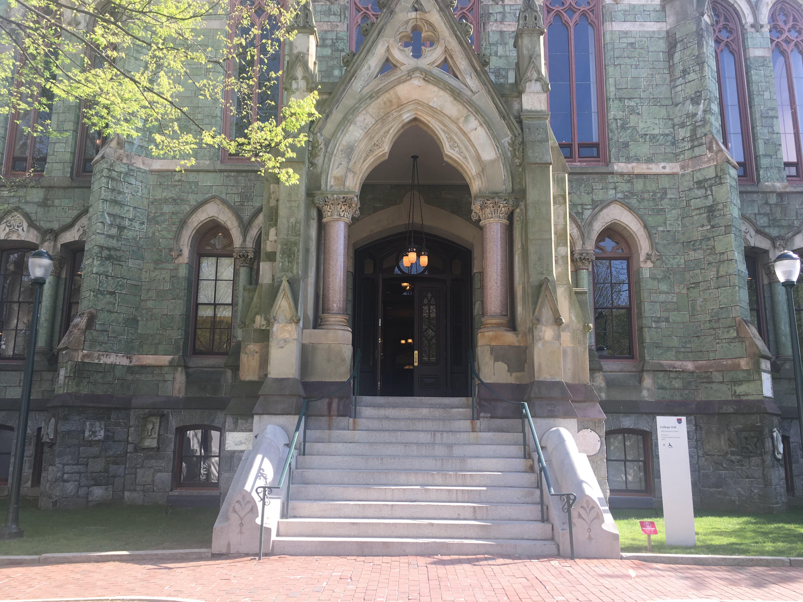

Building name: College Hall

Building code:

Entrance name: Woodland walk entrance (Main Entrance)

Is the entrance width >32 in? Yes

Is the door automatic? No

What is in front of the entrance: level ground/ ramp/ stairs? Stairs

Is there Braille signage at the entrance? No

Braille notes: 

Notes: Up a large flight of stairs. Completely inaccessible.

Image: 

[Home](http://AccessibilityMapping.github.io/AMP)

[Return to Survey Instructions](http://AccessibilityMapping.github.io/AMP/SurveyInstructions)
