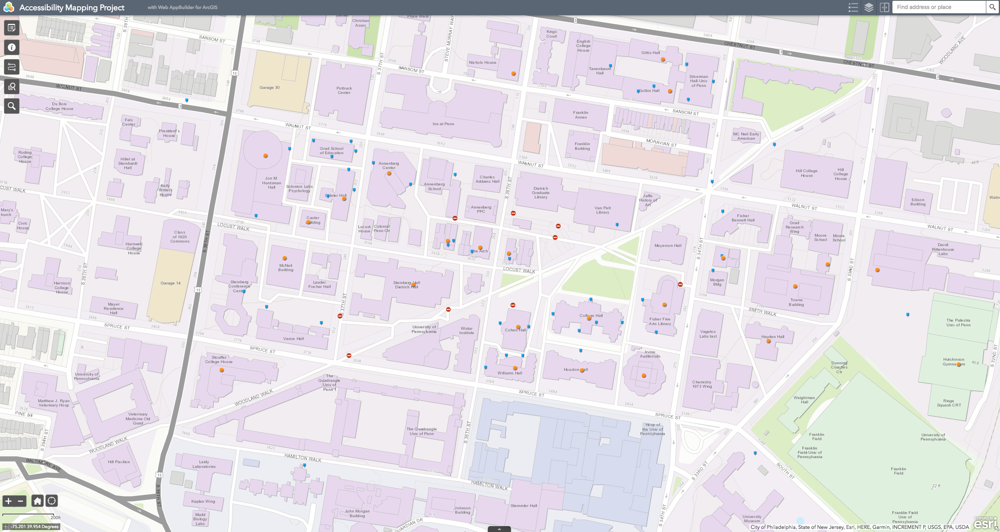
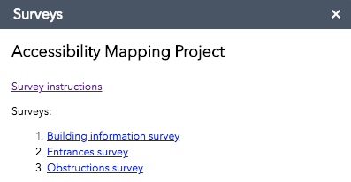

# Web App Guide

The web app referenced in this guide: [Web App](https://upenn.maps.arcgis.com/apps/webappviewer/index.html?id=5d1072b3e8494466bb7c2f4adbf628c3)

## General Interface

The following picture is a general view of the map:

## Adding entries

The best way to **add entries** is through the info button on the left side of the screen.

Once you click on it you will see the following:

Survey instructions will take you to a page containing instructions for all three surveys.

Click on the survey you are interested in. 

All of the surveys have a **Point** section with a **map** at the start that looks like:

Here you get to choose the **spot** you are interested in. 

The map has tools that help you locate the spot more easily. 

On the left side you will see the following:

The home button will return you to the world view.

In the search bar you can type in locations such as “University of Pennsylvania” and the map will display that location.

Press the + button to zoom in.

Press the - button to zoom out.

Press the crosshair to have the map show you your current location (It is not completely accurate).

At the center of the screen is a blue icon, place it in the spot you are interested in. To do so drag your mouse or finger through the map to the desired spot. 
