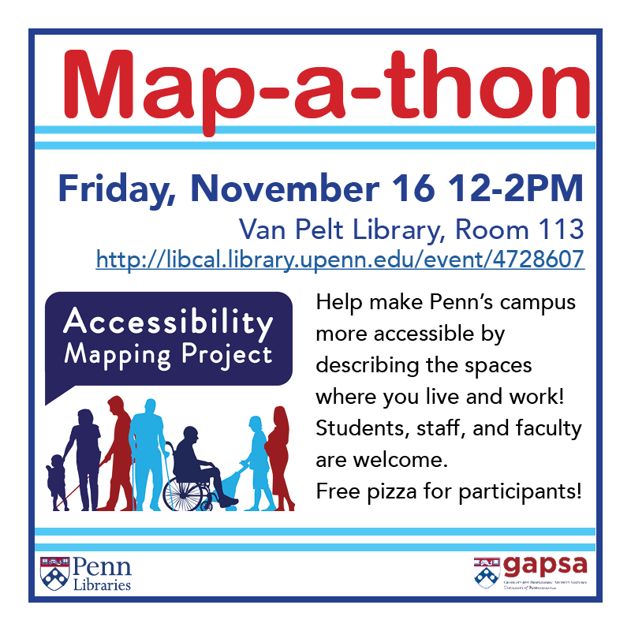

# Events

## Map-a-thon

Friday, November 16, 2018

12:00 PM – 2:00 PM

Van Pelt-Dietrich Library Center, Room 113 (the Collaborative Classroom)
[Registration](http://libcal.library.upenn.edu/event/4728607)

Help make Penn’s campus more accessible by describing the spaces where you live and work!

The Accessibility Mapping Project will be hosting our next Map-a-thon on Friday, November 16 from 12:00-2:00 PM. We will meet in the Collaborative Classroom of Van Pelt Library (Room 133) for instruction and refreshments, then venture out on campus in teams. Students, staff, and faculty are invited: please bring your PennCard and a smart phone or tablet. [Registration](http://libcal.library.upenn.edu/event/4728607) is appreciated but drop-ins are welcome as well.

The [Accessibility Mapping Project](http://web.sas.upenn.edu/access-map/) is a crowd-sourced mapping initiative for Penn’s campus that invites users to record their embodied experience of campus spaces. Intended as a resource for campus navigation, the AMP tool offers user-submitted information on permanent and temporary barriers as well as other accessibility factors, such as light, allergens, gender-neutral/accessible bathrooms, and lactation spaces.

Hosted by the Outreach Subteam of the Accessibility and Learning Technologies Group, with assistance from Penn Libraries and GAPSA.

Question? Want to get involved? Please email Alice McGrath at amcgr@upenn.edu.
